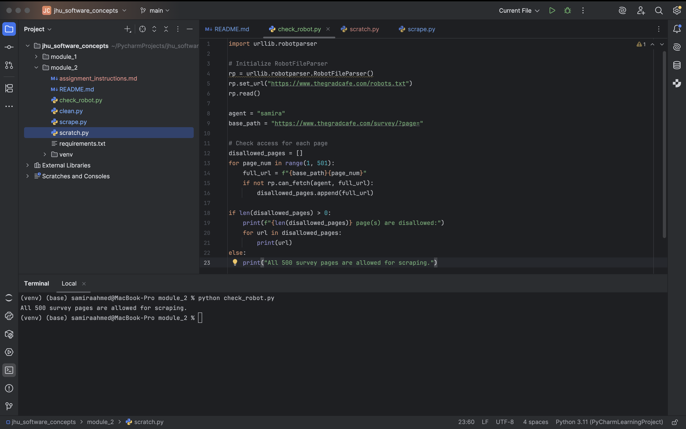

## Name and JHED ID  
**Name:** Samira Ahmed  
**JHED ID:** CD02EC

---

## Module Info  
**Module:** EN.605.256 – Modern Software Concepts in Python
**Assignment:** Web Scraping Project – GradCafe Admission Entries  
**Due Date:** June 01, 2025

---

## Approach

This project involved scraping admission entry data from [TheGradCafe](https://www.thegradcafe.com/survey/) while
complying with the website's `robots.txt` rules. The scraper collected data from up to 500 survey pages (10,000 entries total) 
and stored them in structured Python dictionaries which was later imported to a JSON file.

## Setup 
1. Clone this repository.
2. Open your terminal and navigate into the project folder:  
`cd jhu_software_concepts/module_2`
3. Create and activate a virtual environment, then install dependencies:  
`python -m venv venv`  
`source venv/bin/activate`  
`pip install -r requirements.txt`  
4. Run the data extraction and export script using:
`python clean.py`
5. This will scrape all survey entries from TheGradCafe (pages 1–500) and export the results to a clean, formatted JSON file named:
`applicant_data.json`
6. You can find this file in the `module_2` directory. It will contain thousands of structured entries, each including:
+ University
+ Program
+ Degree
+ Decision and Date
+ Semester 
+ GPA / GRE Scores 
+ Nationality 
+ Comments 
+ Link to applicant post
7. When finished, you can stop the script and deactivate the virtual environment:
`deactivate`

## robots.txt Compliance

Scraper complies with `robots.txt` rules from TheGradCafe.

### Paths Checked: `/survey/`
- `robots.txt` does **not** disallow `/survey/` for any user-agent.
- Only `/cgi-bin/` and `/index-ad-test.php` are disallowed.
- Therefore, accessing `/survey/?page=1` to `/survey/?page=500` is allowed.

### Screenshot Evidence
This  image shows a full screenshot that we comply with `robots.txt` file.
The Python code in the screenshot is used to verify this which is also located in `check_robots.py`

### Scraping Strategy
- Implemented in a class `ScrapeData` inside `scrape.py`.
- Each page is fetched and parsed using `requests` and `BeautifulSoup`.
- Results are extracted from the `<table>` element, specifically paired rows representing each applicant.

### Data Extracted

For each applicant entry, the following data fields were parsed:
- `university`
- `program`
- `degree`
- `decision`
- `added_on` (submission date)
- `semester`
- `nationality`
- `gpa`
- `gre`, `gre_v`, `gre_aw`
- `comment` (if present)
- `applicant_url` (link to original post)

### Techniques Used
- CSS selectors for targeted scraping (e.g., `.select_on`, or `.find()`)
- Regular expressions for matching:
  - GPA values (e.g., `GPA 3.85`)
  - GRE values (e.g., `GRE 330`, `GRE V 160`, `GRE AW 4.0`)
- Skipped non-entry rows like advertisements and placeholder rows.
- The `comment` text was extracted if a row with the appropriate class was found.

## Exporting Data to JSON
The `clean.py` script uses the `ScrapeData` class defined in `scrape.py` to extract structured admissions data from 
TheGradCafe and export it to a JSON file.

### How the `clean.py` Works
1. Imports the scraping class from `scrape.py`.
2. Scrapes data from pages 1 to 500 of TheGradCafe survey.
3. Writes the cleaned, structured data to `applicant_data.json`.

